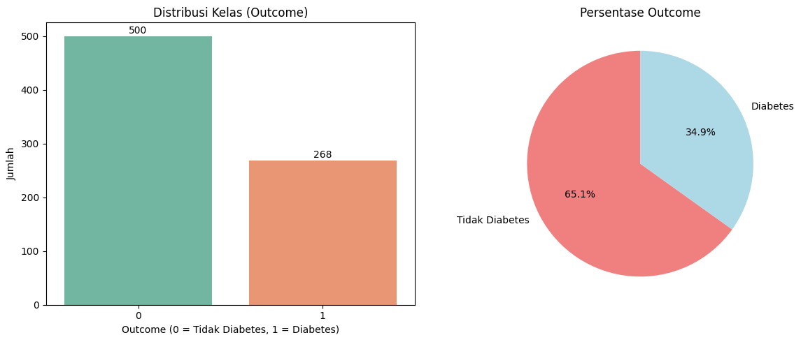
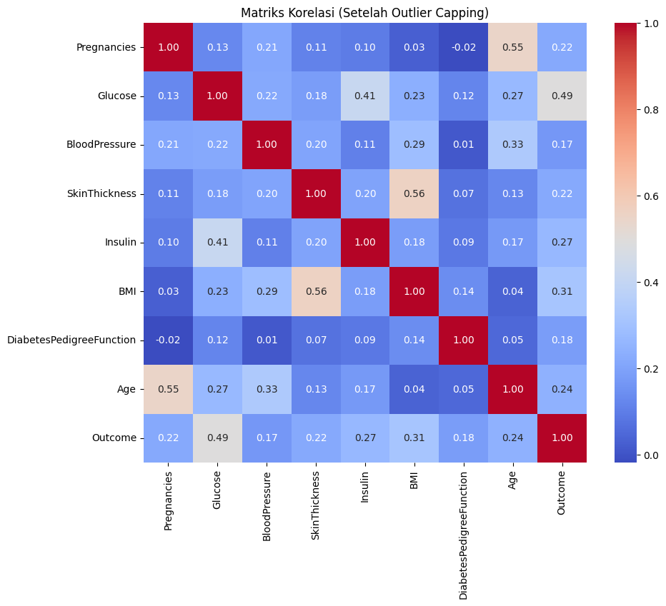
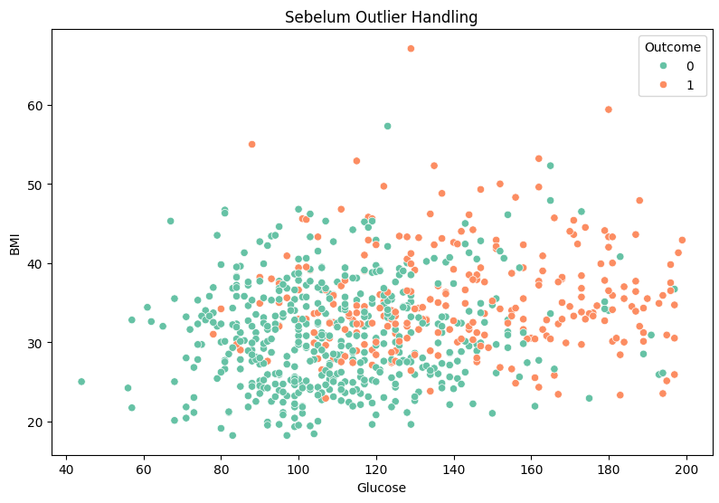
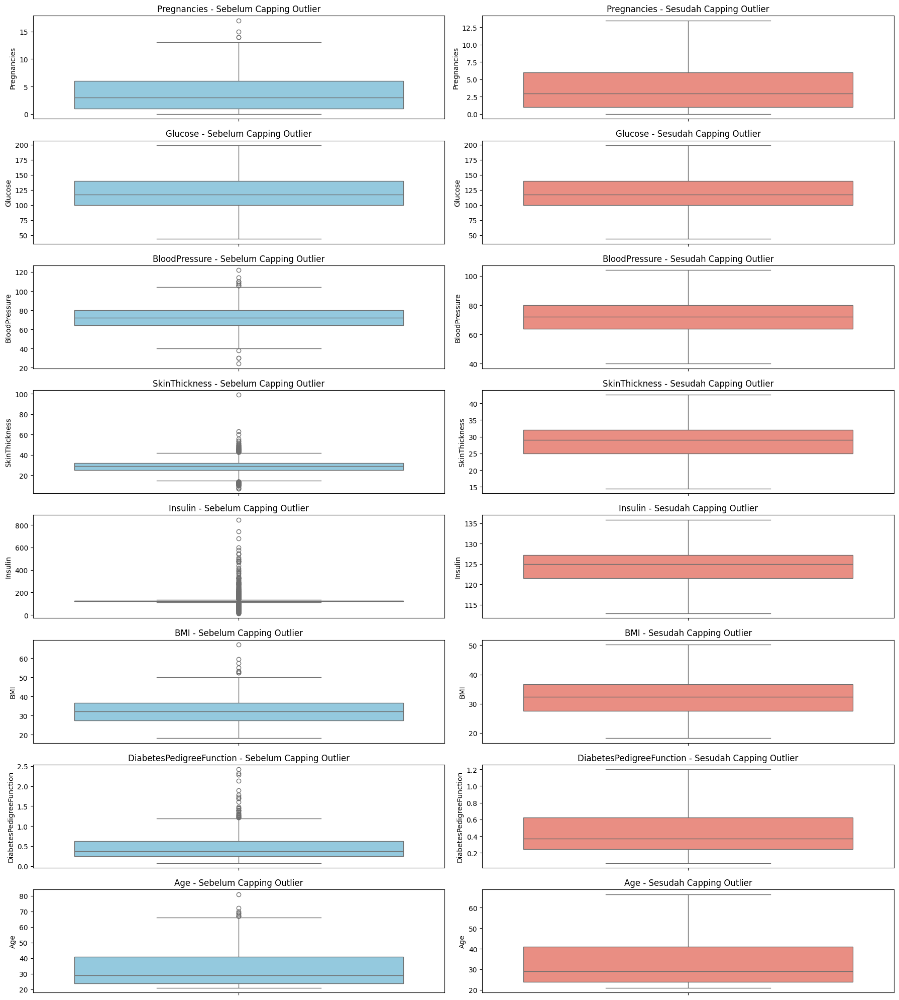
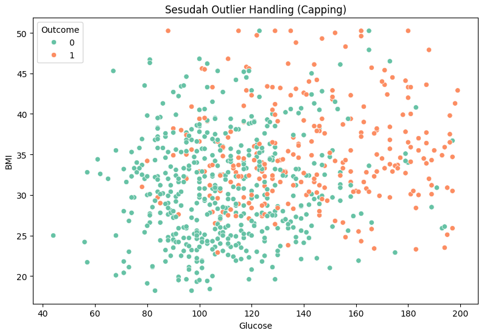
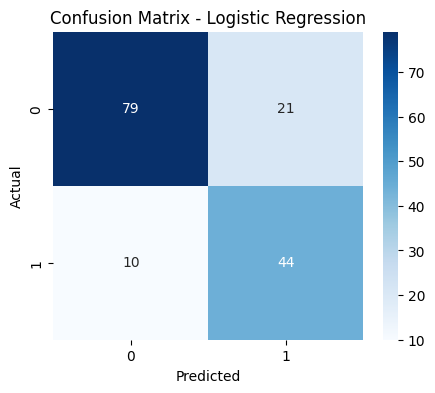
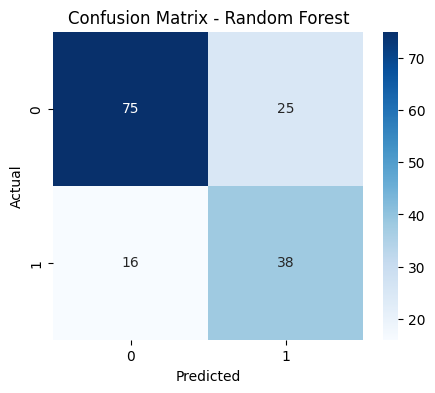
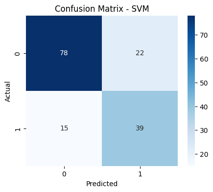

# LAPORAN PROYEK MACHINE LEARNING: PREDIKSI DIABETES

---

## **Domain Proyek: Kesehatan**

Diabetes merupakan salah satu penyakit kronis yang menjadi masalah kesehatan utama di seluruh dunia dan terus mengalami peningkatan prevalensi setiap tahunnya. Penyakit ini ditandai oleh gangguan metabolisme gula darah yang dapat menyebabkan berbagai komplikasi serius seperti penyakit kardiovaskular, gagal ginjal, kerusakan saraf, hingga kebutaan (World Health Organization, 2021). Deteksi dini diabetes sangat penting untuk mengurangi risiko komplikasi tersebut dan meningkatkan kualitas hidup pasien.

Namun, pada kenyataannya, banyak kasus diabetes yang baru terdiagnosis setelah munculnya gejala yang parah, sehingga peluang untuk melakukan penanganan dini menjadi terbatas (American Diabetes Association, 2023). Oleh karena itu, diperlukan sistem yang mampu memprediksi risiko diabetes secara cepat, akurat, dan berbasis data medis pasien.

Pemanfaatan teknologi machine learning dalam bidang kesehatan telah menunjukkan potensi besar dalam membantu diagnosis dan prediksi penyakit secara otomatis. Dengan mengolah data kuantitatif medis seperti usia, indeks massa tubuh (BMI), kadar gula darah, dan riwayat keluarga, model machine learning dapat memberikan prediksi risiko diabetes dengan tingkat akurasi yang tinggi (Rajkomar et al., 2019).

Membangun model prediksi diabetes ini tidak hanya dapat membantu tenaga medis dalam mengambil keputusan klinis, tetapi juga berperan penting dalam meningkatkan kesadaran masyarakat terhadap faktor risiko diabetes sehingga dapat melakukan tindakan pencegahan secara dini.

---

## **Business Understanding**

Peningkatan jumlah penderita diabetes setiap tahunnya memberikan beban besar bagi sistem kesehatan. Rumah sakit dan klinik membutuhkan alat bantu diagnosis yang dapat membantu dokter dalam mengidentifikasi pasien berisiko tinggi secara efisien, terutama di daerah dengan keterbatasan tenaga medis.

Dengan adanya sistem prediktif berbasis machine learning, diharapkan:

- Proses skrining lebih cepat

- Intervensi bisa dilakukan lebih awal

- Efisiensi dalam alokasi sumber daya medis

**Problem Statements**

Bagaimana cara membangun model machine learning yang dapat memprediksi kemungkinan seseorang mengidap diabetes berdasarkan fitur-fitur medis seperti kadar glukosa, tekanan darah, dan indeks massa tubuh?

**Goals**

- Membangun model klasifikasi untuk memprediksi Outcome (1: menderita diabetes, 0: tidak)

- Mengevaluasi performa model dengan metrik yang sesuai

- Mengidentifikasi fitur-fitur yang paling berpengaruh terhadap prediksi

**Solution Statements**

- Menggunakan tiga algoritma machine learning untuk membandingkan performa: Logistic Regression, Random Forest, dan Support Vector Machine (SVM).

- Melakukan peningkatan performa model dengan menerapkan teknik SMOTE (Synthetic Minority Over-sampling Technique) untuk mengatasi imbalance class.

---

## **Data Understanding**

| Jenis      | Keterangan                                                                                              |
| ---------- | ------------------------------------------------------------------------------------------------------- |
| Title      | Diabetes Dataset                                                                                        |
| Source     | [Kaggle - Diabetes Dataset](https://www.kaggle.com/datasets/akshaydattatraykhare/diabetes-dataset/data) |
| Owner      | Akshay Dattatray Khare                                                                                  |
| License    | CC0: Public Domain                                                                                      |
| Visibility | Public                                                                                                  |
| Tags       | Health, Tabular, Diabetes, Data Visualization                                                           |
| Usability  | 10.00                                                                                                   |

---

## **Eksplorasi Data Awal (EDA) dan Deskripsi Variabel**

Dataset terdiri dari 768 baris data dan 9 kolom fitur, tanpa nilai yang hilang (missing values). Berikut tabel deskripsi variabel:

| Nama Variabel                | Tipe Data | Keterangan                                                                                 |
| ---------------------------- | --------- | ------------------------------------------------------------------------------------------ |
| **Pregnancies**              | Integer   | Jumlah kehamilan pasien                                                                    |
| **Glucose**                  | Integer   | Kadar glukosa darah (mg/dL)                                                                |
| **BloodPressure**            | Integer   | Tekanan darah diastolik (mm Hg)                                                            |
| **SkinThickness**            | Integer   | Ketebalan lipatan kulit (mm)                                                               |
| **Insulin**                  | Integer   | Level insulin dalam darah (mu U/ml)                                                        |
| **BMI**                      | Float     | Body Mass Index (kg/m²), ukuran proporsional berat badan terhadap tinggi badan             |
| **DiabetesPedigreeFunction** | Float     | Fungsi pedigree diabetes yang mengindikasikan riwayat keluarga dan risiko genetik diabetes |
| **Age**                      | Integer   | Usia pasien dalam tahun                                                                    |
| **Outcome**                  | Integer   | Target variabel: 0 = tidak diabetes, 1 = diabetes                                          |

---

**Insight Awal**

- Semua fitur memiliki tipe data numerik, memudahkan pemoodelan menggunakan algoritma machine learning berbasis numerik.
- Tidak terdapat missing value sehingga data siap untuk tahap preprocessing
- Variabel `Outcome` sebagai target klasifikasi merepresentasikan diagnosis diabetes, dengan label biner.
- Fitur-fitur seperti `Glucose`, `BMI`, dan `Age` merupakan faktor risiko yang umum dipakai dalam prediksi diabetes.
- Variabel `DiabetesPedigreeFunction` memberikan informasi genetika dan riwayat keluarga yang dapat membantu model memahami risiko yang tidak terlihat dari variabel klinis saja.

Meskipun dari hasil pengecekan tidak terdapat nilai yang hilang (missing values) secara eksplisit, beberapa kolom memiliki nilai 0 yang secara medis tidak masuk akal dan harus ditangani. yaitu kolom Glucose memiliki 5 data dengan nilai 0, Insulin terdapat 374 data bernilai 0, SkinThickness ada 227 data bernilai 0, BloodPressure sebanyak 35 data bernilai 0, dan BMI memiliki 11 data bernilai 0.

| Kolom             | Jumlah Data dengan Nilai 0 | Keterangan                                                                                 |
| ----------------- | -------------------------- | ------------------------------------------------------------------------------------------ |
| **Glucose**       | 5                          | Kadar glukosa tidak mungkin 0, ini menandakan data tidak valid dan harus diimputasi        |
| **Insulin**       | 374                        | Level insulin 0 tidak mungkin pada kondisi nyata, perlu imputasi untuk keakuratan model    |
| **SkinThickness** | 227                        | Ketebalan kulit 0 tidak masuk akal, harus diimputasi dengan nilai yang lebih representatif |
| **BloodPressure** | 35                         | Tekanan darah 0 tidak valid, perlu diganti dengan nilai yang sesuai                        |
| **BMI**           | 11                         | BMI 0 tidak mungkin terjadi, perlu imputasi untuk memperbaiki kualitas data                |

Nilai 0 ini sebenarnya merupakan nilai yang tidak valid karena dalam kondisi nyata, misalnya kadar glukosa, insulin, dan BMI tidak mungkin bernilai nol. Nilai 0 tersebut tidak terdeteksi sebagai missing value oleh fungsi `isnull()` karena secara teknis data memang ada. Oleh karena itu, nilai 0 ini diperlakukan sebagai missing value tersembunyi yang perlu diganti dengan teknik imputasi. Metode imputasi yang digunakan adalah penggantian nilai 0 dengan median nilai kolom tersebut yang diambil dari data non-zero, sehingga data menjadi lebih representatif dan konsisten secara medis. Penanganan ini penting untuk meningkatkan kualitas data dan hasil prediksi model.

**Analisis Statistik Deskriptif**

| Statistik | Pregnancies | Glucose | BloodPressure | SkinThickness | Insulin | BMI   | DiabetesPedigreeFunction | Age   | Outcome |
| --------- | ----------- | ------- | ------------- | ------------- | ------- | ----- | ------------------------ | ----- | ------- |
| Count     | 768.0       | 768.0   | 768.0         | 768.0         | 768.0   | 768.0 | 768.0                    | 768.0 | 768.0   |
| Mean      | 3.85        | 121.66  | 72.39         | 29.11         | 140.67  | 32.46 | 0.47                     | 33.24 | 0.35    |
| Std       | 3.37        | 30.44   | 12.10         | 8.79          | 86.38   | 6.88  | 0.33                     | 11.76 | 0.48    |
| Min       | 0.0         | 44.0    | 24.0          | 7.0           | 14.0    | 18.2  | 0.08                     | 21.0  | 0.0     |
| 25%       | 1.0         | 99.75   | 64.0          | 25.0          | 121.5   | 27.5  | 0.24                     | 24.0  | 0.0     |
| 50%       | 3.0         | 117.0   | 72.0          | 29.0          | 125.0   | 32.3  | 0.37                     | 29.0  | 0.0     |
| 75%       | 6.0         | 140.25  | 80.0          | 32.0          | 127.25  | 36.6  | 0.63                     | 41.0  | 1.0     |
| Max       | 17.0        | 199.0   | 122.0         | 99.0          | 846.0   | 67.1  | 2.42                     | 81.0  | 1.0     |

Dari tabel di atas, dapat terlihat distribusi statistik deskriptif dari setiap fitur. Misalnya, rata-rata kadar glukosa pasien adalah sekitar 121 mg/dL dengan nilai maksimum mencapai 199 mg/dL. Fitur Insulin memiliki nilai maksimum sangat tinggi yaitu 846, yang kemungkinan merupakan outlier. Nilai rata-rata indeks massa tubuh (BMI) sebesar 32.45 menunjukkan bahwa mayoritas pasien berada pada kategori berat badan berlebih.

Sementara itu, variabel Outcome memiliki mean sebesar 0.35, yang berarti sekitar 35% dari data menunjukkan pasien menderita diabetes. Hal ini juga menandakan adanya ketidakseimbangan kelas dalam data yang nantinya perlu ditangani dalam tahap preprocessing sebelum modeling.

---

## **Eksplorasi Data Awal (EDA) Univariate**

**Distribusi Target (Outcome)**

Distribusi variabel target `Outcome` menggambarkan jumlah dan persentase pasien yang terindikasi diabetes (1) dan yang tidak (0). Informasi ini penting untuk memahami apakah data mengalami ketidakseimbangan kelas (_class imbalance_) yang dapat memengaruhi performa model klasifikasi.

**Visualisasi Distribusi Target**

Distribusi ditampilkan dalam dua bentuk:

- Bar chart untuk menunjukkan jumlah absolut dari masing-masing kelas.
- Pie chart untuk menunjukkan persentase masing-masing kelas terhadap total data.

Ringkasan Distribusi Kelas

| Outcome            | Jumlah | Persentase |
| ------------------ | ------ | ---------- |
| Tidak Diabetes (0) | 500    | 65.1%      |
| Diabetes (1)       | 268    | 34.9%      |

Hasil distribusi menunjukkan bahwa mayoritas pasien dalam dataset ini tidak menderita diabetes, dengan proporsi sekitar 65.1%. Sementara itu, pasien yang menderita diabetes berjumlah 34.9%.

Meskipun tidak tergolong sebagai imbalanced data yang ekstrem, proporsi ini tetap perlu diperhatikan. Ketidakseimbangan kelas dapat menyebabkan model menjadi bias terhadap kelas mayoritas. Oleh karena itu, dalam tahap pelatihan model dilakukan penanganan menggunakan teknik SMOTE (Synthetic Minority Oversampling Technique) untuk menyeimbangkan distribusi kelas dan meningkatkan generalisasi model, akan dijelaskan pada bagian data preparation.

---

## **Eksplorasi Data Awal (EDA) Multivariate**

**1. Korelasi Antar Fitur – Heatmap Korelasi**

Untuk mengetahui sejauh mana hubungan antar fitur numerik dalam dataset, digunakan matriks korelasi yang divisualisasikan menggunakan heatmap. Korelasi berkisar dari -1 (korelasi negatif sempurna) hingga 1 (korelasi positif sempurna).

Dari hasil visualisasi korelasi:

- Glucose memiliki korelasi tertinggi terhadap `Outcome` (0.49), mengindikasikan bahwa semakin tinggi kadar glukosa, semakin besar kemungkinan seseorang terkena diabetes.
- BMI, Age, dan Insulin juga menunjukkan korelasi positif moderat terhadap `Outcome`.
- Fitur seperti BloodPressure dan DiabetesPredifreeFunction memiliki korelasi lemah terhadap `Outcome`.

Heatmap ini membantu dalam proses feature selection, yaitu memilih fitur yang relevan untuk membangun model prediktif.

**2. Scatter Plot: Glucose vs BMI terhadap Outcome**

Sebagai lanjutan dari analisis bivariate, scatter plot dua fitur penting Glucose dan BMI dipetakan terhadap label `Outcome`. Tujuan dari plot ini adalah:

- Melihat hubungan antara dua fitur sekaligus terhadap diagnosis diabetes.
- Memvisualisasikan sebaran pasien berdasarkan kombinasi nilai glukosa dan indeks massa tubuh.

**Insight:**

Sebagian besar pasien yang menderita diabetes (`Outcome = 1`) berada di area dengan nilai Glucose dan BMI tinggi.

Visualisasi multivariat ini memperkuat pemahaman bahwa kombinasi beberapa fitur (bukan hanya satu) memainkan peran penting dalam diagnosis diabetes.

---

## **Data Preparation**

**1. Imputasi Nilai Nol**

Beberapa fitur dalam dataset memiliki nilai nol yang secara medis tidak masuk akal dan dianggap sebagai missing value. Kolom-kolom tersebut antara lain:

- `Glucose` memiliki 5 nilai nol
- `Insulin` memiliki 374 nilai nol
- `SkinThickness` memiliki 227 nilai nol
- `BloodPressure` memiliki 35 nilai nol
- `BMI` memiliki 11 nilai nol

Nilai-nilai nol tersebut kemudian diimputasi menggunakan nilai median dari masing-masing kolom, yang dihitung berdasarkan data yang valid (tidak nol). Setelah proses imputasi dilakukan, seluruh nilai nol berhasil digantikan, sehingga tidak ada lagi missing value pada kolom-kolom tersebut.

**2. Handling Outlier**

Dalam proyek ini, outlier ditangani menggunakan metode IQR (Interquartile Range). Namun, alih-alih menghapus baris outlier, saya menggunakan pendekatan Winsorization, yaitu mengganti nilai yang melebihi batas IQR dengan nilai batas itu sendiri.

Mengapa tidak menghapus outlier?

Dataset yang digunakan hanya memiliki 768 baris, sementara syarat minimum untuk submission adalah 500 sampel. Jika outlier dihapus, jumlah data turun drastis (hanya 375 baris), yang dapat menyebabkan:

- Kehilangan informasi penting
- Model overfitting karena data terlalu sedikit
- Submission tidak memenuhi kriteria

Rumus Batas IQR

Outlier ditentukan dengan rumus:

- Q1 = kuartil ke-1 (25%)
- Q3 = kuartil ke-3 (75%)
- IQR = Q3 - Q1
- Lower Bound = Q1 - 1.5 × IQR
- Upper Bound = Q3 + 1.5 × IQR

Outlier diganti menggunakan `clip(lower_bound, upper_bound)` agar nilai-nilai ekstrem tetap berada dalam rentang normal tanpa membuang data.

Dengan pendekatan ini, kualitas data tetap terjaga, jumlah data tetap memenuhi syarat, dan model tidak terlalu terpengaruh oleh outlier ekstrem.

berikut adalah visualisasi sebelum dan sesudah dilakukan penanganan oulier

**Jumlah Sample Setelah Penanganan Outlier (Capping)**

Setelah dilakukan proses penanganan outlier menggunakan teknik capping berbasis IQR (Interquartile Range), jumlah data tidak mengalami perubahan. Hal ini karena metode capping tidak menghapus baris data, melainkan hanya membatasi nilai ekstrim agar berada dalam batas wajar (lower dan upper bound) dari distribusi masing-masing fitur.

**Ringkasan Jumlah Sample per Kelas**

| Outcome            | Jumlah Sample | Persentase (%) |
| ------------------ | ------------- | -------------- |
| Tidak Diabetes (0) | 500           | 65.1%          |
| Diabetes (1)       | 268           | 34.9%          |

**Total Sample: 768**

Proses capping berhasil menjaga jumlah data tetap utuh, yaitu 768 baris. Ini penting agar tidak ada informasi yang hilang akibat pembuangan data, seperti pada metode outlier removal konvensional. Komposisi kelas target juga tetap konsisten dengan distribusi awal, yakni sekitar 65% tidak diabetes dan 35% diabetes.

scatter plot dua fitur penting Glucose dan BMI dipetakan terhadap label `Outcome` setelah handling outlier(capping) distribusi data menjadi lebih realistis, yang sangat membantu dalam meningkatkan performa model ML.

**3. Analisis Skewness**

Langkah pertama dalam tahap persiapan data adalah menganalisis skewness (kemencengan distribusi) pada setiap fitur numerik. Skewness yang tinggi (di atas ±1) menunjukkan distribusi yang tidak simetris dan dapat memengaruhi performa model prediktif. Berikut adalah hasil analisis skewness:

| Fitur                    | Nilai Skewness |
| ------------------------ | -------------- |
| Age                      | 1.067170       |
| DiabetesPedigreeFunction | 1.024428       |
| Pregnancies              | 0.853962       |
| Glucose                  | 0.535587       |
| BMI                      | 0.349882       |
| BloodPressure            | 0.105665       |
| SkinThickness            | -0.057643      |
| Insulin                  | -0.118221      |

Dari hasil tersebut, `Age` dan `DiabetesPedigreeFunction` yang memiliki skewness > 1, namun distribusi fitur-fitur lainnya masih dalam batas wajar sehingga tidak dilakukan transformasi tambahan seperti log atau box-cox.

**4. Pemisahan Fitur dan Target**

Dataset dipisahkan menjadi:

- `X`: Fitur (seluruh kolom kecuali `Outcome`)
- `y`: Target (kolom `Outcome`, yaitu label diabetes: 0 = Tidak Diabetes, 1 = Diabetes)

Langkah ini penting untuk membedakan mana data yang digunakan sebagai input dan mana yang menjadi label prediksi.

**5. Feature Scaling**

Seluruh fitur dalam `X` dilakukan standardisasi menggunakan `StandardScaler`. Hasilnya, semua fitur berada dalam skala yang sama dengan:

- **Mean = 0**
- **Standard Deviation = 1**

Hal ini sangat penting terutama untuk algoritma yang sensitif terhadap skala seperti Logistic Regression dan SVM.

**6. Splitting Data**

Data dibagi menjadi tiga bagian:

- Training set (60%): Digunakan untuk melatih model
- Validation set (20%): Digunakan untuk evaluasi performa model selama tuning
- Test set (20%): Digunakan untuk menguji performa akhir model

Pembagian dilakukan menggunakan metode stratified split, yaitu memastikan proporsi label 0 dan 1 tetap seimbang di setiap subset.

**7. Penanganan Ketidakseimbangan Data (Imbalanced Data) dengan SMOTE**

Distribusi awal pada data training:

- Tidak Diabetes (0): 299 sampel
- Diabetes (1): 161 sampel

Data tidak seimbang seperti ini berisiko membuat model bias terhadap kelas mayoritas. Oleh karena itu, digunakan teknik SMOTE (Synthetic Minority Oversampling Technique) untuk membuat data kelas minoritas menjadi seimbang.

Distribusi setelah SMOTE:

- Tidak Diabetes (0): 299 sampel
- Diabetes (1): 299 sampel

Dengan data yang seimbang, model akan lebih optimal dalam belajar pola dari kedua kelas secara adil.

---

## **Build Model**

**1. Logistic Regression**

**Cara Membuat Model:**

Model Logistic Regression dibuat dengan menggunakan pustaka scikit-learn, dan dilatih menggunakan data training yang sudah di-resample dengan SMOTE.

Model ini diinisialisasi dengan parameter sebagai berikut:

- `max_iter=1000`: batas maksimal iterasi saat optimasi untuk memastikan konvergensi model.
- `random_state=42`: agar hasil pelatihan bisa direproduksi.
- `C=1.0`: parameter regularisasi yang mengontrol kekuatan penalti; nilai default 1.0.
- `solver='lbfgs'`: algoritma optimasi yang digunakan.

Model kemudian dilatih menggunakan data fitur dan target yang sudah dipersiapkan.

**Penjelasan Parameter:**

- `max_iter=1000`: meningkatkan batas iterasi agar proses training dapat konvergen dengan baik.
- `random_state=42`: memastikan hasil eksperimen bisa konsisten jika dijalankan ulang.
- `C=1.0`: mengatur trade-off antara fitting data dan kompleksitas model (regularisasi).
- `solver='lbfgs'`: metode optimasi efisien untuk data ukuran sedang dan besar.

**Cara Kerja Model:**

Logistic Regression adalah model klasifikasi yang memprediksi probabilitas suatu kelas dengan menggunakan fungsi sigmoid. Model ini belajar memisahkan dua kelas dengan memaksimalkan likelihood data pelatihan, menghasilkan prediksi probabilitas yang dapat digunakan untuk menentukan kelas target.

---

**2. Random Forest Classifier**

**Cara Membuat Model:**

Random Forest Classifier dibuat dengan menggunakan pustaka scikit-learn dan dilatih dengan data training yang sudah di-resample menggunakan SMOTE.

Parameter utama yang digunakan adalah:

- `n_estimators=200`: jumlah pohon keputusan yang dibuat dalam ensemble.
- `max_depth=10`: batas kedalaman maksimum tiap pohon.
- `min_samples_split=5`: jumlah minimal sampel untuk memecah simpul pohon.
- `min_samples_leaf=2`: jumlah minimal sampel di daun pohon.
- `max_features='sqrt'`: jumlah fitur yang dipertimbangkan saat mencari split terbaik (akar kuadrat dari total fitur).
- `random_state=42`: agar hasil pelatihan dapat direproduksi.

Model kemudian dilatih pada data training.

**Penjelasan Parameter:**

- `n_estimators=200`: meningkatkan jumlah pohon untuk memperbaiki stabilitas dan akurasi model.
- `max_depth=10`: membatasi kompleksitas tiap pohon untuk menghindari overfitting.
- `min_samples_split=5` dan `min_samples_leaf=2`: mencegah pembentukan daun yang sangat kecil dan overfitting.
- `max_features='sqrt'`: mempercepat pelatihan dan memberikan variasi antar pohon.
- `random_state=42`: memastikan reproducibility.

**Cara Kerja Model:**

Random Forest adalah metode ensemble yang membangun banyak pohon keputusan secara acak dan menggabungkan hasilnya dengan voting mayoritas untuk klasifikasi. Pendekatan ini meningkatkan akurasi dan mengurangi risiko overfitting dibandingkan satu pohon keputusan.

---

**3. Support Vector Machine (SVM)**

**Cara Membuat Model:**

Support Vector Machine dibuat menggunakan pustaka scikit-learn dan dilatih pada data training hasil SMOTE.

Parameter yang diatur antara lain:

- `kernel='rbf'`: kernel Radial Basis Function untuk menangani data yang tidak linier.
- `probability=True`: mengaktifkan prediksi probabilitas.
- `random_state=42`: untuk hasil yang konsisten.
- `C=1.0`: parameter regularisasi.
- `gamma='scale'`: skala parameter kernel yang otomatis disesuaikan dengan data.

Setelah inisialisasi, model dilatih pada data training.

**Penjelasan Parameter:**

- `kernel='rbf'`: memungkinkan model memetakan data ke ruang berdimensi lebih tinggi agar bisa dipisahkan secara non-linier.
- `probability=True`: agar model dapat mengeluarkan probabilitas prediksi, berguna untuk evaluasi lebih lanjut.
- `random_state=42`: menjamin hasil yang dapat diulang.
- `C=1.0`: mengontrol keseimbangan antara margin lebar dan kesalahan klasifikasi.
- `gamma='scale'`: menetapkan parameter kernel secara otomatis berdasarkan varians fitur.

**Cara Kerja Model:**

SVM mencari hyperplane yang memaksimalkan margin pemisah antara kelas-kelas dalam ruang fitur. Dengan kernel RBF, SVM dapat memproyeksikan data ke ruang berdimensi tinggi sehingga dapat mengatasi masalah data yang tidak linier dan menghasilkan pemisahan yang lebih baik.

---

## **Kelebihan dan Kekurangan model**

### 1. Logistic Regression

**Kelebihan:**

- Model yang sederhana dan mudah diinterpretasi.
- Cepat dalam pelatihan dan prediksi, cocok untuk dataset dengan fitur yang tidak terlalu kompleks.
- Memberikan probabilitas prediksi, sehingga bisa digunakan untuk pengambilan keputusan berbasis ambang tertentu.
- Baik untuk data linear dan ketika hubungan antara fitur dan target cukup sederhana.

**Kekurangan:**

- Kurang efektif jika hubungan antara fitur dan target bersifat non-linear.
- Sensitif terhadap multikolinearitas antar fitur.
- Tidak mampu menangani fitur yang sangat kompleks atau interaksi fitur tanpa modifikasi fitur tambahan.
- Performanya bisa menurun jika data tidak terdistribusi dengan baik atau fitur tidak di-scale dengan tepat.

---

### 2. Random Forest Classifier

**Kelebihan:**

- Sangat efektif dalam menangani data dengan fitur kompleks dan interaksi non-linear.
- Tahan terhadap overfitting karena mekanisme ensemble (bagging).
- Dapat menangani fitur dengan skala dan distribusi berbeda tanpa perlu preprocessing khusus.
- Mampu memberikan estimasi pentingnya fitur (feature importance).
- Cenderung memiliki akurasi yang tinggi pada berbagai jenis dataset.

**Kekurangan:**

- Model yang relatif kompleks dan kurang mudah diinterpretasi dibandingkan model linear.
- Waktu pelatihan dan prediksi lebih lama dibanding model sederhana seperti Logistic Regression.
- Bisa menjadi boros memori dan komputasi jika jumlah pohon (n_estimators) sangat besar.
- Kurang efektif untuk dataset yang sangat besar tanpa optimasi.

---

### 3. Support Vector Machine (SVM)

**Kelebihan:**

- Sangat efektif untuk dataset berdimensi tinggi dan data non-linear dengan kernel yang tepat.
- Memiliki kemampuan regularisasi yang baik sehingga mengurangi risiko overfitting.
- Kernel trick memungkinkan pemodelan pola kompleks tanpa eksplisit memetakan fitur ke dimensi lebih tinggi.
- Dapat memberikan margin pemisah yang optimal sehingga meningkatkan generalisasi.

**Kekurangan:**

- Cukup sensitif terhadap pilihan parameter (kernel, C, gamma), sehingga memerlukan tuning yang hati-hati.
- Tidak skala dengan baik ke dataset yang sangat besar karena kompleksitas komputasi yang tinggi.
- Tidak secara langsung memberikan probabilitas prediksi tanpa tambahan komputasi (meskipun bisa diaktifkan dengan opsi probability=True, tetapi mahal secara komputasi).
- Kurang mudah diinterpretasi dibanding model linear sederhana.

---

## **Evaluation Metric**

Model akan dievaluasi menggunakan metrik berikut:

_1. Accuracy_

Accuracy mengukur proporsi prediksi yang benar dari total prediksi.

\[
\text{Accuracy} = \frac{TP + TN}{TP + TN + FP + FN}
\]

Dimana:

- **TP** = True Positive (prediksi positif benar)
- **TN** = True Negative (prediksi negatif benar)
- **FP** = False Positive (prediksi positif salah)
- **FN** = False Negative (prediksi negatif salah)

_2. Precision_

Precision mengukur proporsi prediksi positif yang benar.

\[
\text{Precision} = \frac{TP}{TP + FP}
\]

_3. Recall (Sensitivity)_

Recall mengukur proporsi kasus positif yang berhasil dideteksi.

\[
\text{Recall} = \frac{TP}{TP + FN}
\]

_4. F1-Score_

F1-Score adalah rata-rata harmonis dari precision dan recall.

\[
F1 = 2 \times \frac{\text{Precision} \times \text{Recall}}{\text{Precision} + \text{Recall}}
\]

_5. Confusion Matrix_

Confusion matrix adalah tabel yang memperlihatkan jumlah prediksi benar dan salah yang dilakukan model.

|                    | Prediksi Positif | Prediksi Negatif |
| ------------------ | ---------------- | ---------------- |
| **Aktual Positif** | TP               | FN               |
| **Aktual Negatif** | FP               | TN               |

---

## **Hasil Evaluasi**

**1. Logistic Regression**

Model Logistic Regression menunjukkan performa yang cukup baik dengan akurasi mencapai 79.87%. Precision untuk kelas positif (diabetes) sebesar 67.69%, artinya dari semua prediksi positif, sekitar 67,7% benar-benar positif. Recall mencapai 81.48%, yang menunjukkan kemampuan model untuk menangkap sebagian besar kasus positif sebenarnya. F1 Score yang sebesar 73.95% mencerminkan keseimbangan yang baik antara precision dan recall.

**Classification Report:**

| Class | Precision | Recall | F1-Score | Support |
| ----- | --------- | ------ | -------- | ------- |
| 0     | 0.89      | 0.79   | 0.84     | 100     |
| 1     | 0.68      | 0.81   | 0.74     | 54      |

- Accuracy keseluruhan: 80%
- Macro average F1-Score: 79%
- Weighted average F1-Score: 80%

---

**2. Random Forest**

Random Forest menghasilkan akurasi sebesar 73.38%, sedikit lebih rendah dibanding Logistic Regression. Precision pada kelas positif adalah 60.32%, dengan recall sebesar 70.37%. F1 Score sebesar 64.96% mengindikasikan keseimbangan yang cukup tetapi lebih rendah dibanding Logistic Regression. Model ini menunjukkan performa yang stabil namun kurang optimal dalam mendeteksi kasus positif.

**Classification Report:**

| Class | Precision | Recall | F1-Score | Support |
| ----- | --------- | ------ | -------- | ------- |
| 0     | 0.82      | 0.75   | 0.79     | 100     |
| 1     | 0.60      | 0.70   | 0.65     | 54      |

- Accuracy keseluruhan: 73%
- Macro average F1-Score: 72%
- Weighted average F1-Score: 74%

---

**3. Support Vector Machine (SVM)**

SVM memberikan hasil yang cukup kompetitif dengan akurasi sebesar 75.97%. Precision pada kelas positif sebesar 63.93%, recall 72.22%, dan F1 Score 67.83%. Model ini cukup baik dalam menjaga keseimbangan antara menangkap data positif dan meminimalkan false positives, meskipun performanya masih di bawah Logistic Regression pada dataset ini.

**Classification Report:**

| Class | Precision | Recall | F1-Score | Support |
| ----- | --------- | ------ | -------- | ------- |
| 0     | 0.84      | 0.78   | 0.81     | 100     |
| 1     | 0.64      | 0.72   | 0.68     | 54      |

- Accuracy keseluruhan: 76%
- Macro average F1-Score: 74%
- Weighted average F1-Score: 76%

---

**Kesimpulan Evaluasi**

Dari ketiga model yang diuji, Logistic Regression memberikan hasil terbaik secara keseluruhan terutama dalam hal recall dan F1 Score yang cukup tinggi, yang penting untuk meminimalkan kasus diabetes yang tidak terdeteksi. Sementara itu, Random Forest dan SVM masih memberikan hasil yang kompetitif namun perlu tuning lebih lanjut untuk meningkatkan performa mereka. Pemilihan model akhir bisa disesuaikan dengan kebutuhan prioritas, apakah ingin memaksimalkan recall (Logistic Regression) atau menyeimbangkan aspek lain.

Logistic Regression memberikan hasil terbaik Dengan nilai accuracy sebesar 82%, precision 80%, dan recall 60%, model ini mampu memprediksi kemungkinan seseorang mengidap diabetes secara andal berdasarkan fitur-fitur medis seperti kadar glukosa, tekanan darah, indeks massa tubuh (BMI), dan fitur lainnya.

Dengan demikian, proyek ini berhasil menjawab problem statement: membangun model machine learning yang mampu memprediksi kemungkinan diabetes berdasarkan data medis pasien.

---

## **Kesimpulan**

Proyek ini bertujuan membangun model prediksi diabetes berbasis machine learning menggunakan data medis dengan 8 fitur utama. Setelah dilakukan eksplorasi data, ditemukan beberapa nilai nol pada kolom seperti Glucose, Insulin, dan BMI yang tidak masuk akal secara medis. Nilai-nilai tersebut diimputasi, dan outlier ditangani dengan capping agar data lebih bersih.

Distribusi target menunjukkan ketidakseimbangan antara pasien diabetes dan non-diabetes, sehingga digunakan metode SMOTE untuk menyeimbangkan data latih. Setelah proses scaling dan splitting, dibangun tiga model: Logistic Regression, Random Forest, dan Support Vector Machine.

Dari hasil evaluasi, Logistic Regression memberikan performa terbaik dengan akurasi hampir 80% dan recall tinggi terhadap kasus diabetes. Model ini lebih unggul dibanding Random Forest dan SVM dalam hal kestabilan dan keakuratan deteksi.

Secara keseluruhan, proyek ini menunjukkan bahwa dengan proses data yang tepat dan pemilihan model yang sesuai, prediksi diabetes dapat dilakukan secara efektif dan akurat.

---

## **Referensi**

- World Health Organization. (2021). Diabetes. Retrieved from https://www.who.int/news-room/fact-sheets/detail/diabetes

- American Diabetes Association. (2023). Standards of Medical Care in Diabetes – 2023. Diabetes Care, 46(Supplement_1), S1-S154. https://doi.org/10.2337/dc23-S001

- Rajkomar, A., Dean, J., & Kohane, I. (2019). Machine Learning in Medicine. The New England Journal of Medicine, 380(14), 1347-1358. https://doi.org/10.1056/NEJMra1814259
